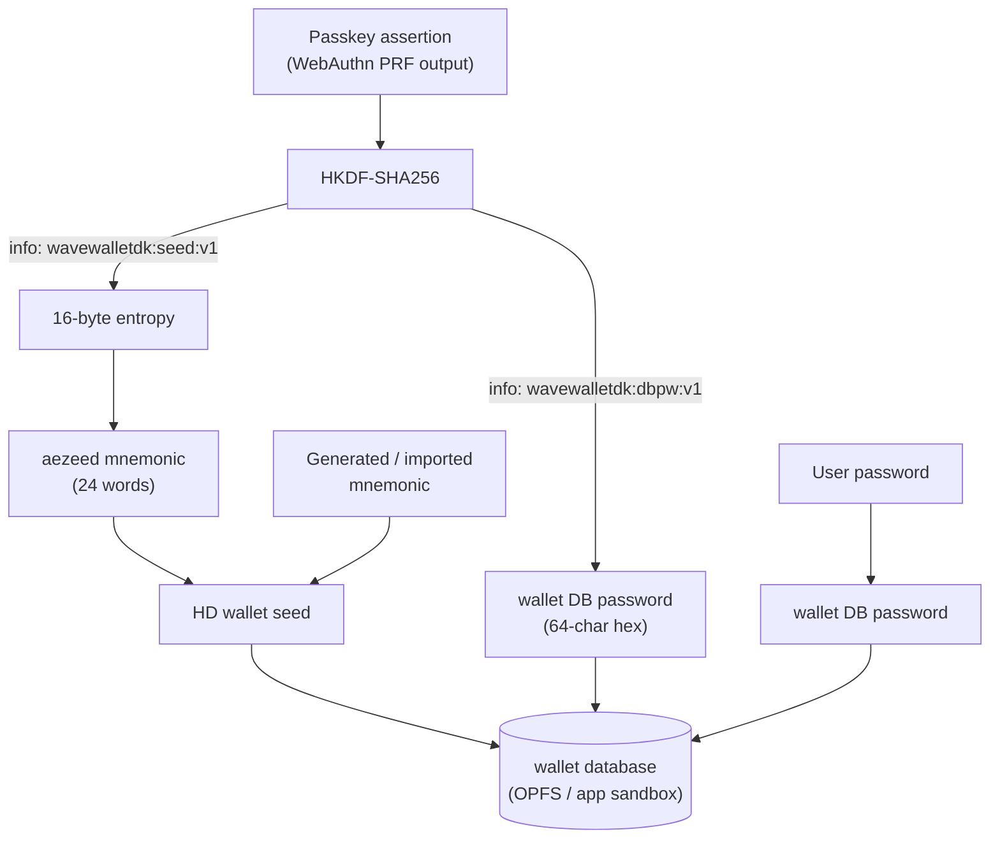

import Callout from '~/components/mdx/Callout.astro';

Every Wavelength wallet is a hierarchical-deterministic (HD) wallet rooted in
a single seed. The seed's origin depends on the auth mode (typed password
or passkey), and everything else follows from it: what sits on disk, what
counts as a backup, and what a user needs to get funds back on a new device.
For the lifecycle states and UI phases around unlock, see
[Wallet lifecycle & auth](/concepts/wallet-lifecycle-and-auth/).

## One seed, two ways to derive it

A **password wallet** gets its seed from a freshly generated (or imported)
24-word mnemonic; the password protects the wallet's key material at rest. A
**passkey wallet** inverts this: the seed itself is *derived* from the
passkey, so the passkey is simultaneously the unlock credential and the root
secret.

Both paths converge on the same storage: the seed lives only inside the
wallet database, encrypted under the wallet DB password and stored
device-locally. On the web that is [OPFS](/web/runtime/data-and-persistence/),
the browser's origin-private file system. On React Native it is a data
directory inside the app sandbox: `RuntimeConfig.dataDir`, defaulting to the
platform path reported by `getDefaultDataDir()`. Either way the database
never leaves the device, and no key material ever reaches the operator or
any server.

## The passkey ceremony

Passkey wallets are built on the WebAuthn **PRF extension**: an authenticator
holds a hidden pseudo-random function per credential, and evaluating it over
a fixed input yields a stable 32-byte secret. The SDK always evaluates the
PRF over the same input, `SHA-256("wavewalletdk-passkey:v1")` (exported from
core as `PASSKEY_PRF_SALT_HEX`), so the same
passkey produces the same secret on every device and every session. That
determinism is the whole design: the PRF output *is* the wallet's root
secret.

On the web, `registerPasskeyWallet(appName)` creates the credential with
`authenticatorAttachment: 'platform'`, `residentKey: 'required'`, and
`userVerification: 'required'`, meaning a discoverable, biometric-gated
passkey in the platform authenticator (Face ID, Touch ID, Windows Hello, or
a synced password manager). Some browsers do not return a PRF result from
the creation ceremony itself, so registration falls back to an immediate
assertion scoped to the just-created credential to read the PRF value
reliably.

`assertPasskeyPrf(credentialId?)` runs the returning-session ceremony. With
a stored `credentialId` the assertion is scoped to that one credential and
the OS unlocks it directly; without one, the assertion is *discoverable*, so
a passkey synced from another device can be offered even though this device
has never seen the wallet. The `credentialId` is not a secret; persisting
it in `localStorage` just skips the credential chooser on the next unlock.

On React Native, `createNativePasskeyCeremony({ rpId })` supplies the same
ceremony through the platform credential APIs: Credential Manager on Android
and AuthenticationServices on iOS (iOS support is experimental and needs iOS
18 or newer). Because every platform evaluates the PRF over the same fixed
input, the same passkey derives the same wallet everywhere: a wallet created
in the browser opens in the app, and vice versa, provided both use the same
relying-party domain.

<Callout type="caution">
Passkeys are bound to the **relying-party ID**. On the web the SDK sets it
to the page's hostname; on React Native you pass `rpId` explicitly and must
associate that domain with your app (see
[Passkey setup](/react-native/get-started/passkey-setup/)). If the app later
moves to a different domain, existing passkeys cannot be asserted there and
passkey-based recovery breaks for every user. Plan the relying-party domain
as a long-term commitment, share it between your web and mobile apps so one
passkey opens both, and treat the mnemonic as the domain-independent escape
hatch.
</Callout>

## Seed derivation

The wallet runtime (the Go SDK, compiled to WASM on the web and bundled as
a native library on React Native) expands the PRF output with
**HKDF-SHA256** into two domain-separated secrets:

| HKDF `info` | Output | Role |
|---|---|---|
| `wavewalletdk:seed:v1` | 16 bytes | aezeed entropy (the HD wallet seed) |
| `wavewalletdk:dbpw:v1` | 32 bytes, hex-encoded | wallet DB password |

The entropy is wrapped into an [aezeed](https://github.com/lightningnetwork/lnd/tree/master/aezeed)
cipher seed with a pinned version and a birthday pinned to the Bitcoin
genesis date, and an **empty seed passphrase**. Pinning all three means the
wallet is a pure function of the PRF output: nothing else needs to be stored
or remembered for the keys to be reproducible.

Two invariants protect this contract:

- **The PRF input never changes.** The evaluation input is fixed per
  namespace version. If a caller ever evaluated the PRF over a different
  input, the same passkey would silently derive a different seed (a
  different wallet), and the original funds would be unreachable until the
  correct input is used again.
- **Short PRF outputs are rejected.** The SDK refuses PRF outputs under 32
  bytes, so a platform bug or empty input cannot collapse the derivation
  into a low-entropy, attacker-reproducible seed.

The derived DB password plays the same role a typed password plays in a
password wallet: it is the private passphrase that encrypts the wallet
database's key material at rest. Because it comes out of HKDF, it carries
the full 32 bytes of entropy, far stronger than any human password. And
because the derivation is deterministic, every device derives the same
password without storing or syncing it, which is why a passkey wallet never
shows a password prompt.

For a **password wallet**, the user's typed password is used directly as the
wallet database passphrase, and the seed comes from a mnemonic generated by
the daemon (`createWallet({ password })`) or imported by the user
(`createWallet({ password, mnemonic })`). An optional seed passphrase
(`seedPassphrase`) can be layered on an imported mnemonic; passkey wallets
always use an empty one.

## What is stored where

| Artifact | Where | Protected by |
|---|---|---|
| HD seed and derived keys | Wallet database in [OPFS](/web/runtime/data-and-persistence/) (web) or the app-sandbox data directory (React Native) | Encrypted under the wallet DB password (typed password, or HKDF-derived for passkey wallets) |
| Swap and daemon bookkeeping | SQLite databases alongside the wallet database | Origin or app-sandbox isolation (no key material) |
| Passkey private key | Platform authenticator / passkey provider | Device biometrics or PIN; provider sync encryption |
| `credentialId`, wallet-kind markers | App-level storage (`localStorage` on web, by convention) | Nothing (not secret) |
| Mnemonic | Wherever the user wrote it down | The user |

Nothing above leaves the device except the passkey itself, which the
platform's passkey provider (iCloud Keychain, Google Password Manager,
1Password, and similar) may sync end-to-end encrypted across the user's
devices. The operator sees signed protocol messages, never keys.

## Backup

A passkey wallet has two independent backup layers:

1. **The synced passkey.** If the user's passkey provider syncs credentials,
   the wallet is already recoverable on any device signed into that
   provider: the PRF travels with the credential, and the seed is derived
   from it on demand. This is the primary, zero-effort layer.
2. **The mnemonic.** When a passkey wallet is created (or first imported on
   a device), the result includes a 24-word aezeed mnemonic. It decodes to
   the same entropy the passkey derives, so it recovers the same wallet
   *without* the passkey, on any domain, in any aezeed-compatible flow.
   Offer it to the user once, encourage writing it down, and do not persist
   it anywhere.

<Callout type="note">
Two exports of the same passkey wallet show **different 24-word phrases**.
aezeed encrypts the entropy under a fresh random salt each time it renders a
mnemonic, so the words differ while deciphering to the same entropy, and
therefore the same wallet. Both phrases are valid backups; a re-export that
differs from the recorded phrase is expected, not a bug.
</Callout>

A password wallet has exactly one backup layer: the mnemonic. The password
cannot be recovered or reset from anywhere, and without the mnemonic a
forgotten password means the funds are gone once the local database is lost.

## Recovery paths

| Scenario | Path | What comes back |
|---|---|---|
| Same device, returning session | Passkey assertion (scoped to the stored `credentialId`) + `openWalletFromPasskey()` / `unlockWallet({ password })` | Everything; the local database is intact |
| New device, synced passkey | Discoverable passkey assertion + `openWalletFromPasskey()`. The wallet state is `'none'`, so the SDK derives the seed and imports it | Keys immediately; the view of funds converges in the background |
| Lost passkey, has mnemonic | `createWallet({ password, mnemonic, recoverState: true })`; the wallet continues as a password wallet | Keys immediately; funds and history via server-assisted recovery |
| Lost passkey and mnemonic | None | Nothing; there is no custodial reset |

Recovery restores the *seed* instantly; restoring the *view* of funds takes
a scan. A mnemonic restore can opt into **server-assisted recovery** with
`recoverState: true`: the daemon walks the seed's addresses and queries the
operator's indexer to rebuild boarding outputs, VTXOs, and Lightning receive
history, tracked in the background through the engine's `'restoring'` phase
and `snapshot.recovery`. See [Restore a wallet](/guides/restore-a-wallet/)
for the full flow. The passkey import path does not run that scan today, so
an app that supports passkey recovery on a fresh device should treat the
imported wallet's view of funds as converging rather than immediate.

<Callout type="caution">
Recovery reproduces keys, not liveness obligations. VTXOs have expiries and
unilateral-exit windows; a wallet that has been offline for a long time
should be brought back online with enough margin to refresh or exit its
VTXOs. See [Leaving Ark](/concepts/leaving-ark/).
</Callout>

## Security model

- **Spending requires the device.** A passkey assertion demands user
  verification (biometric or PIN) on an unlocked device. Anyone who can pass
  that check can derive the seed; there is no second factor beyond the
  platform's.
- **The database at rest is only as strong as its passphrase.** For passkey
  wallets that is 32 bytes of HKDF output, effectively unbreakable offline.
  For password wallets it is the user's password; encourage real passphrases.
- **The app is part of the trust boundary.** Script running on the wallet's
  web origin, or code running inside the mobile app's process, can drive a
  ceremony (still gated by a user-verification prompt) and can read the PRF
  output once a legitimate ceremony completes. XSS on the wallet origin or a
  compromised dependency in the app bundle is therefore equivalent to key
  compromise; treat content-security policy and dependency hygiene as wallet
  security, not routine hygiene.
- **The mnemonic is the root of everything.** Anyone holding the 24 words
  holds the wallet, independent of passkeys, devices, or domains.
